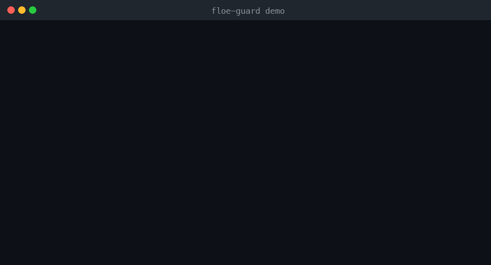

# floe-guard

**A local budget guardrail for AI agents.** It hard-stops your agent *before its
next LLM call* when it would cross a spend ceiling — so a runaway loop dies at
$0.10 instead of $4,000. No account, no signup, no network. Runs in your process.

```bash
pip install floe-guard
```

```python
from floe_guard import BudgetGuard

guard = BudgetGuard(limit_usd=5.00)   # your ceiling
guard.check()                         # before each LLM call — raises if it'd cross
response = call_your_llm(...)         # your existing call
guard.record("gpt-4o", response.usage.prompt_tokens, response.usage.completion_tokens)
```

When the next call would cross the ceiling, the guard raises `BudgetExceeded` and
prints:

```
BUDGET EXCEEDED — call blocked
  spent so far: $5.001250  |  ceiling: $5.000000
  The next call would cross your budget; floe-guard stopped your agent before it ran.
```

_Animated demo coming — run `python examples/runaway_loop.py` to watch it stop a loop live._
<!-- TODO: record docs/stop-the-loop.gif and restore the embed:  -->

## See it stop a loop (no API key needed)

```bash
python examples/runaway_loop.py
```

This rigs a loop against a **stub LLM** — no real API key, no account, no network.
It prices each fake `gpt-4o` call offline and the guard halts the loop after a few
iterations. This is the reproducible "stop the loop" demo.

## How it works

The guard sits **in the call path**, not on an event bus. A passive listener is
told about spend *after the fact* and can't halt anything — so enforcement has to
be the thing standing in front of the next call:

- **`check()`** runs before each LLM call. It predicts the next call's cost from
  the last one and raises `BudgetExceeded` if that would cross your ceiling — the
  call never runs. (A running-total check also catches an overshoot if an estimate
  came in low.)
- **`record(model, prompt_tokens, completion_tokens)`** runs after each response.
  It prices the tokens **offline** from a bundled
  [LiteLLM cost map](src/floe_guard/cost_map.json) and adds the USD to a running
  total.

### Unpriceable models fail closed

If a model isn't in the cost map and you didn't supply a price, the guard **warns
loudly and refuses** (`UnpriceableModelError`) rather than silently treat it as
free — *you can't cap spend you can't measure.* Give it a price to enforce it:

```python
from floe_guard import BudgetGuard, ManualPrice

guard = BudgetGuard(
    limit_usd=5.00,
    price_overrides={"my-self-hosted-model": ManualPrice(1e-6, 2e-6)},  # USD/token
)
# or, set fail_closed=False to warn-and-skip for models you accept un-metered.
```

## Framework adapters (optional extras)

### CrewAI

```bash
pip install floe-guard[crewai]
```

```python
from crewai import Crew
from floe_guard import BudgetGuard
from floe_guard.integrations.crewai import guard_crew

guard = BudgetGuard(limit_usd=1.00)
guard_crew(guard)              # one line — enforces across the whole crew
Crew(agents=[...], tasks=[...]).kickoff()
```

CrewAI runs on LiteLLM, so one callback caps every agent and task under a single
budget.

### LiteLLM

```bash
pip install floe-guard[litellm]
```

```python
from floe_guard import BudgetGuard
from floe_guard.integrations.litellm import guarded_completion

guard = BudgetGuard(limit_usd=1.00)
response = guarded_completion(guard, model="gpt-4o", messages=[...])
```

Prefer the LiteLLM-native callback? Register `budget_guard_callback(guard)` on
`litellm.callbacks`.

### LangChain

```bash
pip install floe-guard[langchain] langchain-openai   # langchain-openai only for the ChatOpenAI example below
```

```python
from langchain_openai import ChatOpenAI
from floe_guard import BudgetGuard
from floe_guard.integrations.langchain import budget_guard_callback_handler

guard = BudgetGuard(limit_usd=1.00)
llm = ChatOpenAI(model="gpt-4o", callbacks=[budget_guard_callback_handler(guard)])
llm.invoke("hello")            # checks budget before the call, records spend after
```

The handler checks the budget on LLM start (raising `BudgetExceeded` aborts the
call before it runs) and records token usage on LLM end.

### Coming next

The Vercel AI SDK (TypeScript middleware) is next. Open an issue if you want one
sooner.

## Honest about what this is

floe-guard is a **local, estimate-based** guardrail. It prices tokens from a
vendored cost map *inside your process*:

- The cost map can drift as vendors change prices — refresh it like any snapshot.
- It only sees the vendors you instrument.
- A determined agent or a bug could route around an in-process check.

It's genuinely useful on its own, and it's honest about its limits. No inflated
metrics, no "zero defaults" claims — it's a free local stop, not a vault.

## Upgrade to hosted Floe

When you need the ceiling to be **un-bypassable** and **cross-vendor**, hosted
Floe moves enforcement server-side against a real credit line:

- **Un-bypassable** — enforced at the spend rail, not in your process.
- **Cross-vendor** — one budget over LLM tokens *and* paid (x402) tool calls.
- **Team budgets + analytics** — shared ceilings, per-agent isolation, spend history.

Set `FLOE_API_KEY` and floe-guard exposes a hook to delegate enforcement to
hosted Floe (see [`src/floe_guard/hosted.py`](src/floe_guard/hosted.py) — wiring
the live endpoint is in progress; the local guard is fully functional today).

→ **[dev-dashboard.floelabs.xyz](https://dev-dashboard.floelabs.xyz)** ·
**[floelabs.xyz](https://floelabs.xyz)**

## Development

```bash
pip install -e ".[dev]"
pytest
ruff check .
```

## License

MIT — see [LICENSE](LICENSE).
