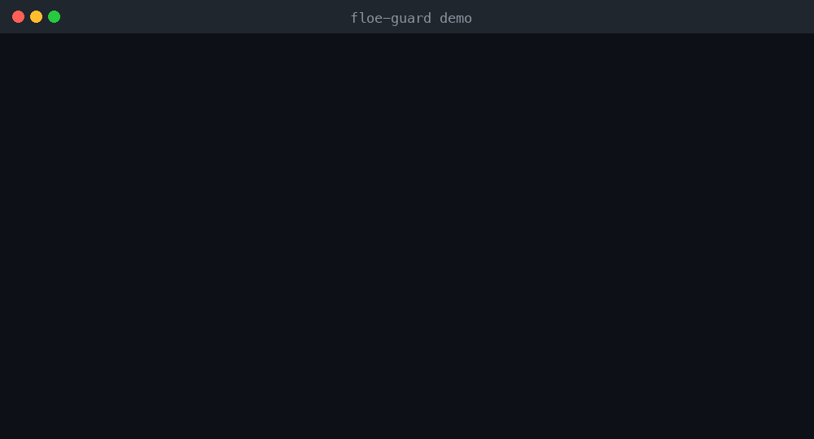

# floe-guard

[](https://pypi.org/project/floe-guard/)
[](https://www.npmjs.com/package/floe-guard)
[](https://pepy.tech/project/floe-guard)
[](https://pypi.org/project/floe-guard/)
[](https://github.com/Floe-Labs/floe-guard/actions/workflows/ci.yml)
[](LICENSE)

**The spend meter and budget gate for AI agents.** Hard-stops the next LLM call,
voice turn, or tool invocation *before* it crosses your USD ceiling — a runaway loop
dies at $0.10 instead of $4,000. In-process, no account, no signup, **no telemetry by default**.

**Python** (`pip install floe-guard`): plain `check()` / `record()` or adapters for
[OpenAI](#openai) · [Anthropic](docs/adapters.md#anthropic) · [Gemini](docs/adapters.md#google-gemini) · [CrewAI](docs/adapters.md#crewai) ·
[LiteLLM](docs/adapters.md#litellm) · [LangChain](docs/adapters.md#langchain) · [LangGraph](docs/adapters.md#langgraph); voice adapters for
[Pipecat](#pipecat-voice) · [LiveKit](#livekit-voice) · [Vapi](#vapi-voice) · [Retell](#retell-voice);
[pre-call admission gates](#voice-admission-gates-pre-call).

**TypeScript** (`npm i floe-guard`): [Vercel AI SDK](docs/adapters.md#vercel-ai-sdk) middleware, native
[LiveKit · Vapi · Retell](#voice-adapters) voice adapters.
See the [adapter matrix](#adapter-matrix) for what ships in Python vs TypeScript.

> Reading this on PyPI? The `docs/…` and `examples/…` links resolve on the
> [GitHub README](https://github.com/Floe-Labs/floe-guard), not on the PyPI page.

The hard-stop is contract-based: adapters gate LLM calls automatically; for paid
tools, [`reserve_tool()` / `settle_tool()`](docs/advanced.md#tool-spend-under-the-same-ceiling)
block *before* the call runs (`record_tool()` alone meters after the fact — it
can't stop a call already made).

## Works best with the Floe skill

`floe-guard` is a local ceiling — it stops paid work before your budget blows, standalone, no account needed. To govern your agent's **whole** vendor bill (LLM, voice, telephony, data) on one key with server-side spend controls, add the **Floe agent skill** — it teaches Claude Code / Cursor the same govern-your-spend workflow `floe-guard` enforces locally:

```bash
npx skills add floe-labs/agent-skills
```

[Floe agent skill →](https://github.com/Floe-Labs/agent-skills) · [Docs →](https://floe-labs.gitbook.io/docs/getting-started/claude-code-skill)

> **AI agents:** this repo self-onboards — [`AGENTS.md`](AGENTS.md) (install → wire → verify),
> [`SKILL.md`](SKILL.md), and [`llms.txt`](llms.txt) let a coding agent add and wire the
> guard unattended.

```bash
pip install floe-guard        # Python
npm i floe-guard              # TypeScript (Vercel AI SDK) — see js/
```

```python
from floe_guard import BudgetGuard

guard = BudgetGuard(limit_usd=5.00)   # your ceiling
guard.check()                         # before each LLM call — raises if it'd cross
response = call_your_llm(...)         # your existing call
guard.record("gpt-4o", response.usage.prompt_tokens, response.usage.completion_tokens)
```

When the next call would cross the ceiling, the guard raises `BudgetExceeded` and
prints:

```
BUDGET EXCEEDED — call blocked
  spent so far: $5.001250  |  ceiling: $5.000000
  The next call would cross your budget; floe-guard stopped your agent before it ran.
```



_Run it yourself, straight from the install: `pip install floe-guard && floe-guard demo` — no API key, no account, no network._

## See it stop a loop (no API key needed)

Straight from the install — no repository checkout needed:

```bash
pip install floe-guard
floe-guard demo
```

This rigs a loop against a **stub LLM** — no real API key, no account, no network.
It prices each fake `gpt-4o` call offline and the guard halts the loop after a few
iterations, before it can cross the $0.10 ceiling. This is the reproducible "stop
the loop" demo. Cloned the repo? The same demo is
[`examples/runaway_loop.py`](examples/runaway_loop.py) (a thin wrapper around
`floe_guard.demo.run_demo`).

## What did that call cost?

The other demo — one voice call, every leg priced from the bundled map, no
manual rates, no API key, no network:

```bash
pip install "floe-guard[livekit]"     # the demo imports livekit-agents
python examples/voice_call_cost_livekit.py
```

```text
Per-leg call cost (all priced from the bundled cost map, no manual rates):
  livekit-stt          $0.001027   # 8s  × ($0.0077/min ÷ 60)   Deepgram Nova-3
  gpt-4o               $0.003700   # 600 in / 220 out tokens    LLM
  livekit-tts          $0.009000   # 180 chars / 1k × $0.05     ElevenLabs Flash
  livekit-telephony    $0.012750   # 1.5 min × $0.0085/min      Twilio US inbound
  TOTAL                $0.026477
```

That's the answer a token-level tool can't give: it meters the LLM leg and
misses the rest of the bill. Rates are a snapshot of public US list prices and
drift — details, caveats, and the Pipecat version in
[Voice adapters](#voice-adapters-stt--llm--tts).

## Why floe-guard?

You can already *see* what your agent spends — the problem is seeing it too late.
floe-guard is the part that **stops the call**, not the part that reports the damage.

- **`max_tokens` / `max_rpm`** cap size and rate, not **dollars** — a cheap model
  stuck in a loop still drains the budget.
- **Usage logs and provider dashboards** tell you what you spent *after* it's gone.
  floe-guard refuses the call *before* it crosses your ceiling.
- **A cost callback that just logs** is notified after the fact and can't halt the
  run — enforcement has to stand in front of the next call. That's where it lives.
- **A hand-rolled `spent += cost` counter races under parallel agents** (CrewAI
  fan-out, `asyncio`, `Promise.all`): N calls read the same under-limit total and
  all fire. floe-guard reserves atomically (`reserve()`/`settle()`), so the ceiling
  holds under concurrency.

The whole job: a hard stop **before** the next call, that **holds under fan-out** —
no account, no network, no crypto.

## How it works

The guard sits **in the call path**, not on an event bus. A passive listener is
told about spend *after the fact* and can't halt anything — so enforcement has to
be the thing standing in front of the next call:

- **`check()`** runs before each LLM call. It predicts the next call's cost from
  the last one and raises `BudgetExceeded` if that would cross your ceiling — the
  call never runs. (A running-total check also catches an overshoot if an estimate
  came in low.)
- **`record(model, prompt_tokens, completion_tokens)`** runs after each response.
  It prices the tokens **offline** from a bundled
  [LiteLLM cost map](src/floe_guard/cost_map.json) and adds the USD to a running
  total.

### Persist one UTC-day budget across processes (Python)

Cron and serverless jobs can share one ceiling only when every process opens the
same database file on storage with reliable SQLite file locking. Isolated
serverless instances with separate local files do not coordinate; use hosted
enforcement when no shared file is available:

```python
from floe_guard import BudgetGuard, SqliteStore

guard = BudgetGuard(
    limit_usd=5.00,
    window="utc-day",
    store=SqliteStore("agent-budget.sqlite3"),
)
reservation = guard.reserve_tool(0.02)  # atomic across sharing processes
guard.settle_tool("search", 0.02, reserved=reservation)
```

One database file represents one logical budget. Settled spend and in-flight
reservations persist until a new UTC date selects a fresh window; per-call logs,
tool attribution, and next-call estimates remain process-local. A process that
dies with a reservation leaves a fail-closed hold that must be recovered
manually. This feature is Python-only and supports `window="utc-day"` only;
arbitrary rolling durations are not yet supported. As elsewhere, enforcement is
estimate-based, so size reservations to the real request when possible.

### Unpriceable models fail closed

If a model isn't in the cost map and you didn't supply a price, the guard **warns
loudly and refuses** (`UnpriceableModelError`) rather than silently treat it as
free — *you can't cap spend you can't measure.* Give it a price to enforce it:

```python
from floe_guard import BudgetGuard, ManualPrice

guard = BudgetGuard(
    limit_usd=5.00,
    price_overrides={"my-self-hosted-model": ManualPrice(1e-6, 2e-6)},  # USD/token
)
# or, set fail_closed=False to warn-and-skip for models you accept un-metered.
```

### What the bundled map prices

The bundled prices are a **dated snapshot** of public list rates — vendors change
them, so treat freshness as a signal, not a guarantee. The snapshot date is
exposed: `floe_guard.cost_map_generated_at()` (Python) / `costMapGeneratedAt()`
(TypeScript) returns the `YYYY-MM-DD` it was last generated/verified, so you can
display it or gate on it.

The vendored map deliberately covers **OpenAI, Anthropic, Google Gemini (AI
Studio), and a curated set of Groq models** (the rules live in
[`scripts/update-cost-map.mjs`](scripts/update-cost-map.mjs)) — not all of
LiteLLM's upstream list. Generic open-weights names (`qwen3-32b`,
`gpt-oss-120b`) are served by many vendors at very different prices, so
resolving them at one vendor's rate would under-meter a spend guard; they stay
unpriceable unless you scope them (`groq/…`) or pass a manual price.

**Gemini is priced at Google AI Studio (Gemini Developer API) rates.** Vertex AI
serves the same model ids at its own — sometimes dearer — rates, and a model id
alone cannot say which billing path a call used, so a Vertex agent should pass
`price_overrides` for the models it uses. Experimental Gemini tiers that Google
lists at $0 stay unpriceable on purpose: a chat model priced at zero would meter
every call as free, which fail-closed pricing cannot catch.

Model ids resolve flexibly: provider-prefixed forms work
(`openai/gpt-4o`, `groq/qwen/qwen3-32b` and the ChatGroq `qwen/qwen3-32b` both
hit the same entry; `gemini/gemini-2.5-flash` and the bare `gemini-2.5-flash`
do too), and a dated snapshot the map doesn't list yet
(`claude-opus-4-8-<date>`) prices at its alias entry instead of failing closed.
Everything else — Mistral, Cohere, Ollama, Bedrock, realtime/audio models,
self-hosted — needs `price_overrides` (or `fail_closed=False` to accept it
un-metered).

## Guard your first real workflow

You've watched it stop a *stub* loop — the real payoff is protecting a *real* one,
where the local ceiling earns its keep. Pick your stack; each is a drop-in adapter,
a few lines, no rearchitecting:

- **OpenAI / Anthropic / Gemini** — [`guarded_completion`](#openai) wraps the client call.
- **LangChain / LangGraph** — a [callback handler](docs/adapters.md#langchain) / [`guarded_node`](docs/adapters.md#langgraph) per fan-out branch.
- **CrewAI / LiteLLM** — [`budget_guarded_llm`](docs/adapters.md#crewai) / [`guarded_completion`](docs/adapters.md#litellm).
- **Voice (Pipecat · LiveKit · Vapi · Retell)** — [per-turn voice adapters](#voice-adapters-stt--llm--tts).

See the [adapter matrix](#adapter-matrix) for what ships in Python vs TypeScript.

## Framework adapters (optional extras)

### OpenAI

```bash
pip install floe-guard[openai]
```

```python
from openai import OpenAI
from floe_guard import BudgetGuard
from floe_guard.integrations.openai import guarded_completion

guard = BudgetGuard(limit_usd=1.00)
client = OpenAI()
response = guarded_completion(guard, client, model="gpt-4o", messages=[...])
```

`guarded_completion` reserves the budget before the call (raising
`BudgetExceeded` so a blocked call never reaches OpenAI) and records spend after.
Use `guarded_acompletion` with an `AsyncOpenAI` client for async. See
[`examples/openai_adapter.py`](examples/openai_adapter.py) for a runnable
hard-stop demo (no API key needed).

Every other adapter follows the same reserve-before / record-after contract — full walkthroughs live in **[docs/adapters.md](docs/adapters.md)**: [CrewAI](docs/adapters.md#crewai) · [LiteLLM](docs/adapters.md#litellm) · [LangChain](docs/adapters.md#langchain) · [LangGraph](docs/adapters.md#langgraph) · [Anthropic](docs/adapters.md#anthropic) · [Gemini](docs/adapters.md#google-gemini) · [Vercel AI SDK](docs/adapters.md#vercel-ai-sdk).

## Voice adapters (STT → LLM → TTS)

A voice pipeline has no single call site to wrap: the LLM sits inside a running
session and turns fire continuously for the life of a call. So instead of a
function wrapper, these adapters enforce **per turn** — reserve before the LLM
call (so a turn is blocked *before* its TTS/audio spend piles on top of a call
that would already cross the ceiling), settle on the real usage the pipeline
reports, and release a turn that ends without ever reporting usage (an
interrupted turn) so the reservation never leaks against the ceiling. This
section covers the **Python** Pipecat, LiveKit, Vapi, and Retell adapters — see
the [Voice adapters](#voice-adapters) section for the TypeScript twins.

**The whole call is priced from the bundled map — no hand-typed rates.** Name each
leg's vendor (`stt_model`, `tts_model`, `telephony`) and floe-guard prices the
full call — STT (per second) + LLM (per token) + TTS (per 1k chars) + telephony
(per minute) — from the vendored voice cost map, so it answers *"what did this
call cost"* at the $0 tier out of the box. A per-unit override
(`stt_usd_per_second` / `tts_usd_per_1k_chars` / `telephony_usd_per_minute`) still
works and wins over the map; a leg with neither a vendor nor an override is left
un-metered (the token-only contract), and a vendor the map cannot price **fails
closed** (`UnpriceableVoiceError`) rather than metering it at a silent $0.

> **Telephony is US-only in v1**, and every voice rate is a **drift-prone
> snapshot** of each vendor's public list price — vendors change these more often
> than the map is refreshed, so treat them as an estimate and re-verify against
> the live pricing page before trusting a figure. The rates live under the
> `"__voice__"` key of [`cost_map.json`](src/floe_guard/cost_map.json); refresh
> them with [`scripts/update-cost-map.mjs`](scripts/update-cost-map.mjs). Seeded
> vendors: Deepgram, AssemblyAI (STT); ElevenLabs, Cartesia Sonic, Rime (TTS);
> Twilio, Cartesia Line (telephony). Telnyx is deferred pending a verified list
> rate. Enforcement stays
> **pre-turn admission** (reserve-before-turn) — telephony is **per-minute
> accrual**, not live line-cutting.
>
> Some vendors don't bill in the map's canonical unit: TTS priced natively
> per audio-minute (Cartesia Sonic, Rime) is converted at an assumed ~1000
> chars/min, and per-session overhead (e.g. AssemblyAI) isn't modeled — so a
> metered leg is an **estimate**, not the exact invoice, and can under- or
> over-state it. `floe-guard` is a **local pacing ceiling**; the authoritative
> cap is server-side.

Per-leg breakdown from one call (no manual prices — `python
examples/voice_call_cost_livekit.py`, no API key, no network):

```text
Per-leg call cost (all priced from the bundled cost map, no manual rates):
  livekit-stt          $0.001027   # 8s  × ($0.0077/min ÷ 60)   Deepgram Nova-3
  gpt-4o               $0.003700   # 600 in / 220 out tokens    LLM
  livekit-tts          $0.009000   # 180 chars / 1k × $0.05     ElevenLabs Flash
  livekit-telephony    $0.012750   # 1.5 min × $0.0085/min      Twilio US inbound
  TOTAL                $0.026477
```

### Pipecat (voice)

```bash
pip install floe-guard[pipecat]
```

Drop a `FloeBudgetGuardProcessor` into the pipeline directly after the LLM
service. It reserves on each turn's `LLMFullResponseStartFrame` and settles from
the `LLMUsageMetricsData` Pipecat emits — so the pipeline's `PipelineTask` must
be created with `enable_metrics=True, enable_usage_metrics=True`.

```python
from pipecat.pipeline.pipeline import Pipeline
from pipecat.pipeline.task import PipelineTask, PipelineParams
from floe_guard import BudgetGuard
from floe_guard.integrations.pipecat import FloeBudgetGuardProcessor

guard = BudgetGuard(limit_usd=1.00)

pipeline = Pipeline([
    transport.input(),
    stt,
    context_aggregator.user(),
    llm,
    FloeBudgetGuardProcessor(guard, model="gpt-4o"),   # meters AND hard-stops
    tts,
    transport.output(),
    context_aggregator.assistant(),
])
task = PipelineTask(
    pipeline,
    params=PipelineParams(enable_metrics=True, enable_usage_metrics=True),
)
```

> **Fragment** — `transport`, `stt`, `llm`, `tts`, and `context_aggregator` are your existing Pipecat objects; this shows only where the guard sits in a pipeline you already have. For a complete, runnable demo (no API key, no network — needs `pip install floe-guard[pipecat]`), see [`examples/voice_turn_budget.py`](examples/voice_turn_budget.py).

By default a blocked turn pushes a fatal `ErrorFrame` that terminates the
pipeline — the hard-stop every other adapter gives you. Pass an
`on_budget_exceeded` async callback to speak a graceful "wrapping up" line first
instead of cutting the call dead.

Name the vendors to meter the rest of the call from the map:
`tts_model="elevenlabs-flash-v2.5"` auto-meters the `TTSUsageMetricsData` Pipecat
emits; `stt_model` / `telephony` are metered explicitly (Pipecat emits no STT/
telephony usage frame) via `processor.meter_stt(seconds)` /
`processor.meter_telephony(minutes)`. See
[`examples/voice_call_cost_pipecat.py`](examples/voice_call_cost_pipecat.py) for
the full per-leg breakdown (no API key, no network — needs `pip install floe-guard[pipecat]`).

### LiveKit (voice)

```bash
pip install floe-guard[livekit]
```

`LiveKitBudgetGuard.attach(session, agent)` wires the reserve-before /
settle-after contract onto a LiveKit `AgentSession`: it reserves in the agent's
`llm_node` and settles on the session's `metrics_collected` `LLMMetrics`.
LiveKit's `LLMMetrics` doesn't report the served model, so cost settles against
the `model` you pass here.

```python
from livekit.agents import AgentSession
from floe_guard import BudgetGuard, ManualPrice
from floe_guard.integrations.livekit import LiveKitBudgetGuard

guard = BudgetGuard(
    limit_usd=1.00,
    price_overrides={"gemini-2.0-flash": ManualPrice(0.30e-6, 2.50e-6)},
)
budget = LiveKitBudgetGuard(guard, model="gemini-2.0-flash")

session = AgentSession(...)
budget.attach(session, agent)      # wire reserve / settle / release
await session.start(agent=agent, room=ctx.room)
```

> **Fragment** — `session`, `agent`, and `ctx.room` come from your LiveKit agent entrypoint (`JobContext`); this shows only where the guard attaches.

Name the vendors — `stt_model="deepgram-nova-3"`, `tts_model="elevenlabs-flash-v2.5"`,
`telephony="twilio-us-inbound-local"` — to meter STT/TTS/telephony (often a voice
agent's larger bill) from the map via `record_tool`, no hand-typed rates. STT/TTS
settle automatically off LiveKit's metrics events; drive telephony per-minute with
`budget.meter_telephony(minutes)`. Per-unit overrides (`stt_usd_per_second` /
`tts_usd_per_1k_chars` / `telephony_usd_per_minute`) still work and win over the
map, and an `on_budget_exceeded` async callback speaks a wrap-up line before a turn
ends. See [`examples/voice_call_cost_livekit.py`](examples/voice_call_cost_livekit.py)
for the full per-leg breakdown (no API key) and
[`examples/voice_turn_budget.py`](examples/voice_turn_budget.py) for the hard-stop.

### Vapi (voice)

```bash
pip install floe-guard            # the Vapi adapter is framework-free — no extra
```

The custom-LLM proxy sees only the **model leg**, so `VapiBudgetGuard` guards the
`/chat/completions` turn and admits the call via the `assistant-request` webhook.
`guard_completion` (JSON) and `guard_stream` (SSE) reserve the estimated cost
**before** the upstream call, settle on Vapi's real OpenAI `usage` afterwards,
and release the hold on error/abort — so an over-budget turn gets a 402 instead
of reaching your LLM. Set `stream_options={"include_usage": True}` on the
upstream streaming request or `guard_stream` fails loudly (the SSE omits `usage`
without it).

```python
from floe_guard import BudgetGuard
from floe_guard.errors import BudgetExceeded
from floe_guard.integrations.vapi import VapiBudgetGuard

guard = BudgetGuard(limit_usd=1.00)
budget = VapiBudgetGuard(
    guard,
    stt_model="deepgram-nova-3",   # $/sec from the voice map
    tts_model="elevenlabs-flash-v2.5",  # $/1k-chars from the voice map
    telephony="twilio-us-inbound-local",  # $/min from the voice map
)

# POST /chat/completions — the custom-LLM endpoint Vapi calls each turn.
completion = await budget.guard_completion(
    lambda: openai_client.chat.completions.create(model=model, messages=messages),
    model=model,
)
#  budget exhausted → BudgetExceeded (return a 402), never proxied upstream
```

`budget.meter_stt(seconds)` / `budget.meter_tts(chars)` /
`budget.meter_telephony(minutes)` accrue the legs the proxy never sees (drive
them from Vapi's `end-of-call-report` webhook). Name the vendors to price them
from the map, or pass per-unit overrides (`stt_usd_per_second` /
`tts_usd_per_1k_chars` / `telephony_usd_per_minute`) that win over it. See
[`examples/voice_call_cost_vapi.py`](examples/voice_call_cost_vapi.py) for the
per-leg breakdown (no API key, no network).

### Retell (voice)

```bash
pip install floe-guard            # the Retell adapter is framework-free — no extra
```

Retell's custom LLM runs over a WebSocket. `RetellBudgetGuard` reserves when a
`response_required` interaction arrives (before the LLM call, so a turn is
blocked before its TTS/telephony spend piles on), settles on the turn's real
token usage after `content_complete`, and releases the hold when a newer
`response_id` interrupts. Tick the `response` events you already stream —
Retell sends plain dict events over `ws`:

```python
from floe_guard import BudgetGuard
from floe_guard.integrations.retell import RetellBudgetGuard

guard = BudgetGuard(limit_usd=1.00)
budget = RetellBudgetGuard(guard, model="gpt-4o-mini")

# in your custom-LLM WS message handler:
turn = budget.begin_turn(event)          # reserve before the LLM call
if not turn.admitted:                    # budget exhausted → wrap up the call
    await ws.send(json.dumps(budget.response(event["response_id"],
                                             "I'm out of budget — wrapping up.",
                                             complete=True, end_call=True)))
    return
await ws.send(json.dumps(budget.response(event["response_id"], text, complete=True)))
budget.settle_turn(event["response_id"], {"promptTokens": n, "completionTokens": m})
```

`budget.meter_stt` / `meter_tts` / `meter_telephony` meter the legs the socket
never sees (from wherever the durations are known), priced from the voice map
when you name the vendor or a per-unit override. `budget.close()` releases any
still-open hold on call teardown. See
[`examples/voice_call_cost_retell.py`](examples/voice_call_cost_retell.py) for the
per-leg breakdown (no API key, no network).

## Voice admission gates (pre-call)

The adapters above meter a call that's already running. `floe_guard.gates` is the
step *before* that: at the call boundary, **admit or reject** an inbound call from
the budget left — and it returns the exact JSON shape each orchestrator's inbound
webhook expects, so the same reject contract you serve locally is the one hosted
Floe serves. The paid upgrade is a URL swap, not a rewrite.

```python
from floe_guard import BudgetGuard, gates

guard = BudgetGuard.from_floe(api_key="floe_…")   # or a local BudgetGuard(limit_usd=…)

# Retell inbound webhook — only the boolean `true` rejects:
gates.retell(guard)
#  budget left → {"call_inbound": {}}          (admit; pass admit={"dynamic_variables": …})
#  exhausted   → {"call_inbound": {"reject": True}}

# Vapi assistant-request webhook — respond within ~7.5s:
gates.vapi(guard, assistant_id="asst_…")
#  budget left → {"assistantId": "asst_…"}     (or assistant={…} for an inline assistant)
#  exhausted   → {"error": "Sorry, this agent is out of budget right now."}

# Pipecat / custom / Bland — the provider-agnostic decision:
if not gates.pre_call(guard):
    ...  # reject at your call boundary
```

Pass `estimated_call_usd=` to reject when the remaining budget can't cover the
next call (e.g. `$/min × expected minutes`), not just when it's fully spent.

**Non-binding preflight.** A gate *reads* the remaining budget; it does not
reserve it, so under concurrent inbound calls it can admit more than the budget
strictly covers. It's coarse admission control — the binding, atomic money-gate
stays the in-call guard (`check` / `reserve` while the call runs), same as hosted
Floe's check-only pre-dial gate.

**Pre-call admission only.** A gate decides whether a call *starts*; it does not
intervene mid-call. Once admitted, a call runs to completion — nothing here cuts
one off partway. (`guard_stream` can stop a single LLM *generation*, which is not
call-level intervention.) Budget, not balance. US-only telephony, v1.

> **Verification notes.** Retell's inbound webhook fires for inbound **phone/SMS**
> calls (not dial-to-sip); its web-call behaviour isn't documented. Bland's *Send
> Call* metadata field name is unconfirmed, so there's no `gates.bland()` yet — use
> `gates.pre_call(guard)` and wire the reject into Bland's Pathway Webhook node.

## Adapter matrix

| Adapter | Python | TypeScript |
|---|---|---|
| OpenAI | ✅ | via [Vercel AI SDK](docs/adapters.md#vercel-ai-sdk) |
| Anthropic | ✅ | via [Vercel AI SDK](docs/adapters.md#vercel-ai-sdk) |
| Google Gemini | ✅ | via [Vercel AI SDK](docs/adapters.md#vercel-ai-sdk) |
| LangChain | ✅ | — |
| LangGraph | ✅ | — |
| CrewAI | ✅ | — |
| LiteLLM | ✅ | — |
| Vercel AI SDK | — | ✅ |
| **LiveKit** (voice) | ✅ | ✅ |
| **Vapi** (voice) | ✅ | ✅ |
| **Retell** (voice) | ✅ | ✅ |
| **Pipecat** (voice) | ✅ | — |

The packages ship **voice-leg pricing** (`price_voice_leg` / `priceVoiceLeg`),
**pre-call admission gates** (`gates.retell` / `gates.vapi` / `gates.pre_call` /
`gates.preCall`), and **native voice adapters** for LiveKit, Vapi, and Retell
(below) — Python and TypeScript in lockstep.

### Voice adapters

Python and TypeScript ship native STT → LLM → TTS session adapters for the voice
stacks. Each reserves before the model turn, settles on real usage, releases on
interrupt, and meters STT/TTS/telephony legs from the `__voice__` cost map
(fail-closed via `UnpriceableVoiceError`) — the same enforcement contract across
both languages. **Pre-turn / pre-call admission plus per-turn settlement only;
no mid-call cutoff.**

```ts
// LiveKit Agents (Node) — @livekit/agents is an optional peer
import { LiveKitBudgetGuard } from "floe-guard/adapters/livekit";
new LiveKitBudgetGuard(guard, { model, sttModel, ttsModel, telephony }).attach(session, agent);

// Vapi custom-LLM proxy — wrap the /chat/completions turn
import { VapiBudgetGuard } from "floe-guard/adapters/vapi";
const budget = new VapiBudgetGuard(guard, { sttModel, ttsModel, telephony });
const completion = await budget.guardCompletion(() => openai.chat.completions.create(req), { model });

// Retell custom-LLM WebSocket — reserve on response_required, settle on content_complete
import { RetellBudgetGuard } from "floe-guard/adapters/retell";
const decision = budget.beginTurn(event);        // { admitted } — reserves before the LLM call
budget.settleTurn(event.response_id, usage);     // settle real usage after content_complete
```

```python
# Vapi custom-LLM proxy — wrap the /chat/completions turn
from floe_guard.integrations.vapi import VapiBudgetGuard

budget = VapiBudgetGuard(guard, stt_model="deepgram-nova-3", tts_model="elevenlabs-flash-v2.5",
                         telephony="twilio-us-inbound-local")
completion = await budget.guard_completion(  # reserve → run → settle on real usage
    lambda: openai_client.chat.completions.create(model=model, messages=body["messages"]),
    model=model,
)

# Retell custom-LLM WebSocket — reserve on response_required, settle on content_complete
from floe_guard.integrations.retell import RetellBudgetGuard

budget = RetellBudgetGuard(guard, model="gpt-4o-mini")
decision = budget.begin_turn(event)       # { admitted } — reserves before the LLM call
budget.settle_turn(event["response_id"], usage)  # settle real usage after content_complete
```

Each ships a runnable, no-key demo (`examples/voice_call_cost_livekit.py`,
`examples/voice_call_cost_vapi.py`, `examples/voice_call_cost_retell.py`; Node
`js/examples/*_voice_cost.mjs`) that prints a pre-call admission decision and a
per-leg call-cost receipt; see the module docstrings for the full API. Pipecat's
server pipeline is Python-only, so its budget processor lives in the Python
package (`FloeBudgetGuardProcessor`) — there is no Node Pipecat server surface
to adapt.

For wiring floe-guard into an existing voice pipeline, see the Floe docs:
**[Add Floe to your existing pipeline](https://floe-labs.gitbook.io/docs/getting-started/integrate-existing-pipeline)**.

## Context-aware budgeting

The hard-stop is the guarantee; `advisory()` is the *upside*. Read it before a
step to let your agent **adapt** as it nears the cap — taper to a cheaper model,
shrink the task, or wrap up — instead of getting cut off mid-run.

```python
guard = BudgetGuard(limit_usd=0.10, near_limit_bps=7000)   # flag at 70% used

adv = guard.advisory()
# BudgetAdvisory(near_limit=False, used_bps=125, remaining_usd=0.0987, ...)
model = "gpt-4o-mini" if adv.near_limit else "gpt-4o"        # downshift near the cap

# On the very first call, check() has no historical usage to predict cost with.
# To ensure the ceiling is enforced on the first run, pass an estimated cost:
guard.check(estimated_cost=0.01)  # still the hard line — taper or not, this holds
response = call_your_llm(model)
guard.record(model, response.usage.prompt_tokens, response.usage.completion_tokens)
```

`advisory()` returns `near_limit`, `used_bps` (utilization in basis points),
`remaining_usd`, and the budget totals. It also reports `expected_cost` (the
guard's own next-call estimate) and `est_calls_remaining` (how many more calls
the remaining budget buys, `None` until the first call is recorded) — call
headroom, not just dollars. For voice, it also reports `burn_rate_usd_per_min`
(spend ÷ minutes since the guard was created — the $/min voice teams watch;
make one guard per call/turn for a per-call rate, `None` before any time
elapses). It's a **soft** signal — the model may
ignore it; `check()` is what enforces the ceiling. See
[`examples/budget_aware.py`](examples/budget_aware.py) for a runnable taper demo
(no API key).

Model choice is only one axis. The same signal drives **any** cost lever, and in
most agents the bigger levers are elsewhere — retrieval depth
([`examples/retrieval_depth.py`](examples/retrieval_depth.py): RAG `top_k` falls
20 → 12 → 5), context size
([`examples/context_size.py`](examples/context_size.py): stop resending the whole
transcript, cap replies shorter), and plan complexity
([`examples/plan_complexity.py`](examples/plan_complexity.py): thin the reasoning,
then drop the optional sub-tasks to protect the required ones). Each holds the
model fixed and shrinks a non-model parameter as the budget drains (no API key).

### Budget-aware retry

Blind retries can spend the same expensive path again right when the agent is
running out of headroom. `with_budget_retry()` composes over the existing guard:
retry normally while budget is healthy, ask your code for a cheaper retry plan
when `advisory().near_limit` is true, and call `check(estimated_cost)` before
each retry so an over-budget retry never runs.

```python
from floe_guard import BudgetGuard, RetryPlan, with_budget_retry

guard = BudgetGuard(limit_usd=1.00)

def premium_model():
    return call_model("gpt-4o")

def mini_model():
    return call_model("gpt-4o-mini")

result = with_budget_retry(
    guard,
    premium_model,
    estimated_cost=0.20,
    max_attempts=2,
    on_degrade=lambda exc, adv: RetryPlan(call=mini_model, estimated_cost=0.01),
)
```

The helper does not rank models or know provider pricing; the caller defines
what "cheaper" means in `on_degrade`. TypeScript exposes the same pattern as
`withBudgetRetry()`. See [`examples/budget_retry.py`](examples/budget_retry.py)
for a no-network demo.

The taper logic you just wrote carries over to hosted — the same near-limit
signal (`near_limit` + `used_bps`), answered across *every* vendor and cap; the
hosted `X-Floe-Budget-Advisory` header nests it under `tightest` with raw-integer
amounts, so field access is a light remap. See
[One line to hosted](#one-line-to-hosted). The TypeScript package exposes
`guard.advisory()`, mapping fields from Python's `snake_case` (e.g., `near_limit`,
`used_bps`, `remaining_usd`) to TypeScript's `camelCase` (`nearLimit`, `usedBps`,
`remainingUsd`), with newer TypeScript fields marked as optional. The JSONL schema and
behavior produced by `exportLog()` match Python's `export_log()` exactly.

## Spend log, tools, tokens & deadlines

Beyond the dollar hard-stop, floe-guard carries a few more budget dimensions — full reference in **[docs/advanced.md](docs/advanced.md)**:

- **[Per-call spend log](docs/advanced.md#per-call-spend-log)** — a typed in-memory ledger of everything priced; `export_log()` emits stable JSONL.
- **[Tool spend under the same ceiling](docs/advanced.md#tool-spend-under-the-same-ceiling)** — `reserve_tool()` / `settle_tool()` put paid API calls under the same cap as tokens.
- **[Token ceilings & per-step budgets](docs/advanced.md#token-ceilings-and-per-step-budgets)** — a token cap and per-step cap alongside the USD ceiling.
- **[LatencyBudget](docs/advanced.md#latencybudget--deadlines-the-same-way)** — the same reserve/advisory pattern for time against an SLA.
- **[Request-sized estimates & mid-stream enforcement](docs/advanced.md#request-sized-estimates-and-mid-stream-enforcement)** — `estimate_call()` for the oversized first call; `guard_stream()` to cut a stream mid-generation.

## One line to hosted

Already on hosted Floe? Keep every line of your code — swap the constructor.
`from_floe` reads your **server-side budget headroom** and uses it as the local
ceiling, so the free→hosted upgrade is one line:

```python
from floe_guard import BudgetGuard

guard = BudgetGuard.from_floe(api_key="floe_…")   # ceiling = your hosted headroom
guard.check()                                     # everything else is unchanged
response = call_your_llm(...)
guard.record("gpt-4o", response.usage.prompt_tokens, response.usage.completion_tokens)
```

Budget, not balance: the read is a *headroom* signal and enforcement stays
**local** — [hosted Floe](#when-you-outgrow-local-guardrails) remains the source
of truth for the un-bypassable, cross-vendor cap. No key set → no network (the
[zero-telemetry](#no-telemetry) invariant holds); a failed read fails closed
(pass `fallback_limit_usd=` to degrade to a local ceiling instead).

Your tapering logic carries over, too: local `advisory()` and hosted's
`X-Floe-Budget-Advisory` header expose the same **near-limit signal**
(`near_limit` + `used_bps` utilization), so the "near the cap? taper now"
decision you branch on is the same. The wire shapes differ — the hosted header
nests the tightest cap under `tightest` with raw-integer amounts, so field access
is a light remap — but it answers that signal across *every* vendor and cap, not
just the one you instrumented locally.

## Honest about what this is

floe-guard is a **local, estimate-based** guardrail. It prices tokens from a
vendored cost map *inside your process*:

- The cost map can drift as vendors change prices — refresh it like any snapshot.
- It only sees the vendors you instrument.
- A determined agent or a bug could route around an in-process check.
- Under heavy or cold-start concurrency it bounds steady-state spend, not the
  first parallel wave. Reservations default to the last call's cost (`0` until
  the first `record()`) — size them to the real request with `estimate_call()`
  (the LiteLLM adapter does this for you), or use hosted Floe for a hard cap
  under arbitrary concurrency.
- Mid-stream enforcement (`guard_stream`) prices chunks by a ~4 chars/token
  heuristic unless you supply a tokenizer, so the cut-off point is approximate;
  the final accrual reconciles to provider-reported usage.

It's genuinely useful on its own, and it's honest about its limits. No inflated
metrics, no "zero defaults" claims — it's a free local stop, not a vault.

## No telemetry

floe-guard does **not** phone home. It sends no usage events, no install pings,
no identifiers — nothing leaves your process at runtime except **two things you
explicitly opt into**: hosted-budget reads (set `FLOE_API_KEY` / use
[`from_floe`](#one-line-to-hosted)) and [ledger sync](#sync-your-ledger-for-coverage-score-opt-in)
(`enable_sync()` / `floe-guard push`). Never otherwise, and never in the
background.

This is a choice, not an oversight. A guardrail's whole value is trust: a
library that silently exfiltrates usage from people's agents is the opposite of
a tool you hand a budget to.

## Sync your ledger for Coverage Score (opt-in)

Floe's gateway can't see spend it never routed — BYOK, self-hosted, or off-path
LLM/tool calls. **Ledger sync** is the opt-in that closes that gap: it pushes your
local spend ledger into Floe's Reconcile Mode so your **Coverage Score** (the
share of your agent's spend Floe can actually enforce) becomes computable for
off-path spend. Budget, not balance — it reports what you *already spent* for
coverage and attribution; it moves no money and changes no wallet balance.

**Off by default, always.** Two explicit steps — opt in, then send — and no
background send ever:

```python
guard.enable_sync(api_key="floe_…")   # opt in (read_write agent key). Sends nothing yet.
...                                    # run your agent; spend accrues on the guard
n = guard.sync()                       # THE send — POSTs export_log() now; returns events accepted
guard.disable_sync()                   # revoke; the guard sends nothing after this
```

Or one-shot from a saved ledger:

```bash
floe-guard push ledger.jsonl --key floe_…   # or: your_export_log_producer | floe-guard push
```

**The request body is exactly the [`export_log()`](docs/advanced.md#per-call-spend-log) JSONL** —
one line per priced spend event: `timestamp`, `kind` (`llm`/`tool`),
`model_or_tool`, `prompt_tokens`, `completion_tokens`, `cost_usd`, and the
optional `label` / `reserved` you set. **No prompts, no message content, no
identifiers** beyond a `label` you choose — and it's *enforced*, not just
promised: `push_ledger` validates every line and refuses any record with a field
outside that schema, so nothing extra can leave even from a hand-edited ledger.
Your key rides the `Authorization` header, and redirects are refused so neither
key nor ledger can be re-sent to an unapproved host. Re-syncing is safe — the sync
endpoint is idempotent by design, so already-ingested events aren't
double-counted. A guard that never called `enable_sync()` never sends (a `sync()`
on it raises, with zero network) — the [no-telemetry](#no-telemetry) default holds.

## When you outgrow local guardrails

`floe-guard` stops overspend **per process, locally** — no account, no network.
When the ceiling needs to hold across your whole fleet, hosted Floe moves
enforcement server-side.

| | floe-guard (this repo) | Hosted Floe |
|---|---|---|
| Runs | Locally, in your process | Server-side |
| Scope | One process | Every vendor and agent |
| Control | Hard stop at your cap | Kill switch + one unified ledger |

Already on hosted Floe? The package's only network call is the opt-in hosted
budget read: set `FLOE_API_KEY` (agent key `floe_…`) and `hosted_remaining_usd()`
returns the server-side budget headroom via `GET /v1/agents/credit-remaining`.
`FLOE_API_BASE_URL` overrides the API host (default
`https://credit-api.floelabs.xyz`). Nothing runs unless the key is set.
The [one-line upgrade](#one-line-to-hosted) is `BudgetGuard.from_floe(api_key=…)`,
which uses that headroom as the local ceiling — budget, not balance, and
enforcement stays local.

→ [dev-dashboard.floelabs.xyz](https://dev-dashboard.floelabs.xyz/)

## Examples

All runnable examples live in [`examples/`](examples/). Use `python examples/<file>` from the repo root.

| Example | Description | Extra | API key / network |
|---|---|---|---|
| [`runaway_loop.py`](examples/runaway_loop.py) | The canonical hard-stop demo — a stub loop halted before it crosses $0.10 | none | none |
| [`streaming_guard.py`](examples/streaming_guard.py) | Pre-flight block on an oversized first call + mid-stream cut-off via `guard_stream()` | none | none |
| [`budget_aware.py`](examples/budget_aware.py) | Context-aware tapering: agent downshifts to a cheap model when `advisory().near_limit` trips | none | none |
| [`budget_retry.py`](examples/budget_retry.py) | Budget-aware retry / graceful degradation with `with_budget_retry()` | none | none |
| [`context_size.py`](examples/context_size.py) | Context size adapts to budget: history trimmed and `max_tokens` capped near the ceiling | none | none |
| [`plan_complexity.py`](examples/plan_complexity.py) | Plan complexity adapts: optional sub-tasks dropped and reasoning depth reduced near the cap | none | none |
| [`retrieval_depth.py`](examples/retrieval_depth.py) | RAG `top_k` shrinks in two steps (20→12→5) as budget drains | none | none |
| [`step_budget.py`](examples/step_budget.py) | Per-step token caps for a sequential loop: one runaway step blocked without stopping the run | none | none |
| [`tool_budget.py`](examples/tool_budget.py) | Tool spend (Apollo lookups, Exa searches) as a first-class citizen of the same USD ceiling | none | none |
| [`openai_adapter.py`](examples/openai_adapter.py) | `guarded_completion` against a duck-typed stub — exercises the real pre-flight hard-stop | none | none |
| [`anthropic_adapter.py`](examples/anthropic_adapter.py) | Anthropic adapter with native prompt-cache pricing (cache write vs. cache read vs. uncached) | none | none |
| [`langgraph_budget_aware.py`](examples/langgraph_budget_aware.py) | LangGraph `guarded_node` fan-out with an advisory-driven router that tapers before the cap | `pip install floe-guard[langgraph]` | none |
| [`langchain_groq_example.py`](examples/langchain_groq_example.py) | LangChain callback handler on ChatGroq (Llama-3): call 1 succeeds, call 2 is hard-stopped | `pip install floe-guard[langchain] langchain-groq` | `GROQ_API_KEY` + network |
| [`voice_turn_budget.py`](examples/voice_turn_budget.py) | Pipecat pipeline with `FloeBudgetGuardProcessor`: multi-turn voice conversation halted mid-run | `pip install floe-guard[pipecat]` | none |
| [`voice_call_cost_pipecat.py`](examples/voice_call_cost_pipecat.py) | Full per-leg call cost (STT + LLM + TTS + telephony) via Pipecat, priced from the bundled map | `pip install floe-guard[pipecat]` | none |
| [`voice_call_cost_livekit.py`](examples/voice_call_cost_livekit.py) | Full per-leg call cost (STT + LLM + TTS + telephony) via LiveKit, priced from the bundled map | `pip install floe-guard[livekit]` | none |
| [`voice_call_cost_vapi.py`](examples/voice_call_cost_vapi.py) | Full per-leg call cost (STT + LLM + TTS + telephony) via the Vapi custom-LLM proxy, priced from the bundled map | `pip install floe-guard` | none |
| [`voice_call_cost_retell.py`](examples/voice_call_cost_retell.py) | Full per-leg call cost (STT + LLM + TTS + telephony) via the Retell custom-LLM WebSocket, priced from the bundled map | `pip install floe-guard` | none |

## Built with floe-guard

Using floe-guard in your project? Add the badge so others find it:

[](https://github.com/Floe-Labs/floe-guard)

```markdown
[](https://github.com/Floe-Labs/floe-guard)
```

## Development

```bash
pip install -e ".[dev]"
pytest
ruff check .
```

For the TypeScript package, see [`js/README.md`](js/README.md). Contributions
are welcome — start with [CONTRIBUTING.md](CONTRIBUTING.md); releases are
tracked in [CHANGELOG.md](CHANGELOG.md).

## License

MIT — see [LICENSE](LICENSE).
